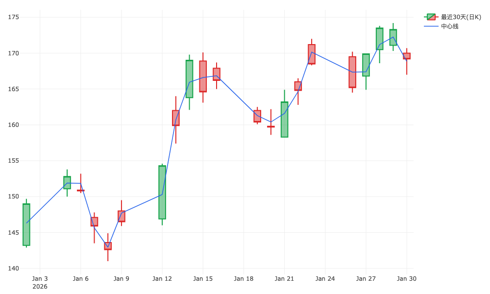
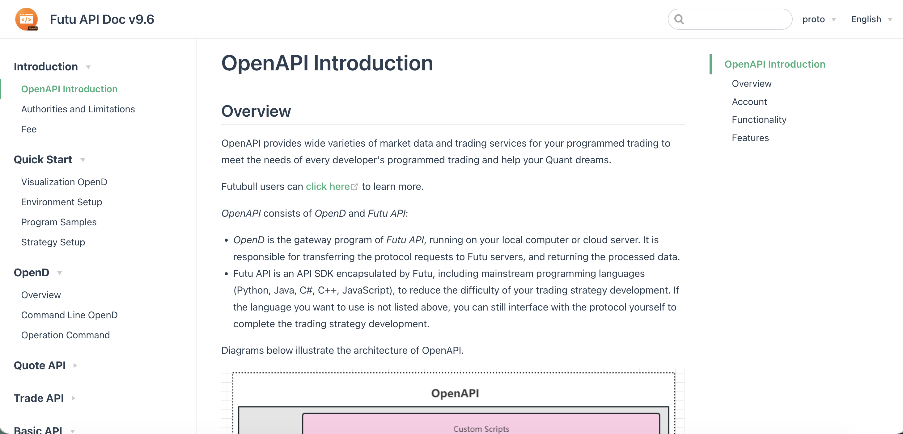

# go-futu-api

[富途牛牛OpenD](https://openapi.futunn.com/futu-api-doc/ftapi/init.html) Go API【非官方】


## 在树莓派(arm64)上运行OpenD

> 也可以安装Windows/MacOS/Linux（amd64)等版本，开发时推荐使用GUI版本方便调试

使用[box64](https://github.com/ptitSeb/box64)

先运行`box64 ./FTUpdate`保证软件是最新的, 然后运行`box64 ./FutuOpenD`

## 本地下载和解压 OpenD

仓库里提供了 `Makefile` 目标来下载并解压 Ubuntu 版 OpenD，本地文件会放在 `.opend/` 下，并且默认不会进入 git。

```bash
make opend-setup
```

常用目标：

- `make opend-download`：只下载压缩包到 `.opend/downloads/`
- `make opend-setup`：下载并解压到 `.opend/app/`
- `make opend-clean`：删除本地 OpenD 文件


## 代码示例

更多代码参考[cmd/main.go](cmd/main.go)

```go
package main

import (
	"context"
	"fmt"
	"log"
	"os"
	"os/signal"
	"syscall"
	"time"

	"github.com/qtopie/gofutuapi"
	"github.com/qtopie/gofutuapi/gen/common/getuserinfo"
	"google.golang.org/protobuf/proto"
)

func main() {
	ctx, cancel := signal.NotifyContext(context.Background(), os.Interrupt, syscall.SIGTERM)
	defer cancel()

  // 建立连接
	conn, err := gofutuapi.Open(ctx, gofutuapi.FutuApiOption{
		Address: "localhost:11111",
		Timeout: 5 * time.Second,
	})
	if err != nil {
		log.Fatalf("Failed to connect: %v", err)
	}
	defer conn.Close() // Ensure the connection is closed when done

  // 构造获取用户基本信息请求
	flag := int32(getuserinfo.UserInfoField_UserInfoField_Basic)
	req := getuserinfo.Request{
		C2S: &getuserinfo.C2S{
			Flag: &flag,
		},
	}
  // 发送请求数据包
	conn.SendProto(1005, &req)
  // 读取响应
	reply, err := conn.NextReplyPacket()
	if err != nil {
		log.Println(err)
	} else {
		var resp getuserinfo.Response
		err = proto.Unmarshal(reply.Payload, &resp)
		if err != nil {
			panic(err)
		}
     // 打印结果
		log.Println(resp.String())
	}

	<-ctx.Done()
	fmt.Println("Main goroutine exiting.")
}
```

也可以直接使用客户端封装查询待成交订单：

```go
client := gofutuapi.NewClient(conn)
orders, err := client.GetPendingOrders()
if err != nil {
	log.Fatal(err)
}

for _, order := range orders {
	log.Printf("%s %s qty=%.2f price=%.2f status=%d",
		order.GetCode(),
		order.GetName(),
		order.GetQty(),
		order.GetPrice(),
		order.GetOrderStatus(),
	)
}
```

解锁交易也已经封装好了。为了避免把密码写进代码，可以用环境变量运行：

```bash
FUTU_TRADE_PASSWORD='your-trade-password' go run ./cmd/unlocktrade
```

代码中对应的方法是：

```go
client := gofutuapi.NewClient(conn)
err := client.UnlockTrade("your-trade-password", trdcommon.SecurityFirm_SecurityFirm_FutuSecurities)
```

如果你想直接打印真实账户的当前资金、持仓和当日订单，可以运行：

```bash
go run ./cmd/checkus -market US
go run ./cmd/checkus -market HK
go run ./cmd/checkus -market US -debug-accounts
go run ./cmd/checkus -all-accounts
go run ./cmd/checkus -acc-id 281756456013616044
```

## K线可视化（Plotly）

运行示例会生成 `docs/kl-data.json`，并启动内置 Go HTTP 服务展示最近 7 天、30 天、180 天（月K）、3 年（季K）的K线。

```bash
go run ./cmd
```

然后访问：`http://localhost:8000/kl-viewer.html`



## ⚖️ 法律声明 (Legal Disclaimer)

本项目是基于富途证券 (Futu Securities) [公开协议文档](https://openapi.futunn.com/futu-api-doc/en/intro/intro.html)开发的第三方 Go 语言集成库。

- **合规性**：本项目遵循富途官方关于“自行对接协议”的指引。
- **协议修改说明**：为适配 Go 语言特性，本项目对原始 `.proto` 定义进行了必要的命名规范调整和技术适配。
- **免责声明**：本项目不提供任何金融投资建议，不对因代码 Bug 或交易导致的亏损负责。使用前请详细阅读 [LEGAL_NOTICE.md](./LEGAL_NOTICE.md)。


