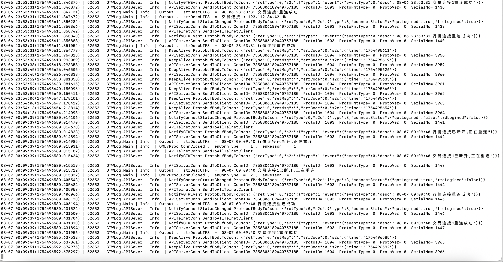

## 怎么初始化连接

参考 com.futu.openapi.NetManager#connect

初始化包的代码在这里 com.futu.openapi.FTAPI_Conn#sendInitConnect

参考 sendProto(ProtoID.INIT_CONNECT, req);

返回响应处理参考
handleNetEvents 

onRead

NIO相关 https://juejin.cn/post/7120529881229852685

## 日志

## OpenD 权限与可用接口速查

以下总结基于你的 OpenD 行情权限：

- 香港市场：股票 LV2、期权 LV2
- 美国市场：期权 LV1（股票/指数/期货均无权限）
- A 股市场：上证 LV1、深证 LV1
- 其他期货市场（CME/CBOT/NYMEX/COMEX/CBOE/新加坡/日本）：无权限

### 权限影响原则

- **接口可调用 ≠ 有权限**：多数 `QOT_*` 接口可发起，但无权限会报错或返回空数据。
- **等级影响深度**：LV2 通常支持更完整的盘口/逐笔/队列等数据；LV1 可能受限。

### 你有权限的行情接口

#### 港股（股票 LV2）

- 基础行情与快照：`QOT_GETBASICQOT`、`QOT_GETSECURITYSNAPSHOT`
- 实时/分时：`QOT_GETRT`、推送 `QOT_UPDATERT`
- K 线：`QOT_GETKL`、`QOT_REQUESTHISTORYKL`
- 盘口/逐笔/经纪队列（LV2 更完整）：`QOT_GETORDERBOOK`、`QOT_GETTICKER`、`QOT_GETBROKER`
- 订阅与推送：`QOT_SUB`、`QOT_REGQOTPUSH`、`QOT_UPDATEBASICQOT`、`QOT_UPDATEORDERBOOK`、`QOT_UPDATETICKER`、`QOT_UPDATEBROKER`

#### 港股（期权 LV2）

- 期权链与到期日：`QOT_GETOPTIONCHAIN`、`QOT_GETOPTIONEXPIRATIONDATE`
- 行情与快照：`QOT_GETBASICQOT`、`QOT_GETRT`、`QOT_GETKL`、`QOT_GETSECURITYSNAPSHOT`

#### A 股（上证/深证 LV1）

- 基础行情与快照：`QOT_GETBASICQOT`、`QOT_GETSECURITYSNAPSHOT`
- 实时/分时：`QOT_GETRT`、推送 `QOT_UPDATERT`
- K 线：`QOT_GETKL`、`QOT_REQUESTHISTORYKL`
- 订阅与推送：`QOT_SUB`、`QOT_REGQOTPUSH`、`QOT_UPDATEBASICQOT`

#### 美股（期权 LV1）

- 期权链与到期日：`QOT_GETOPTIONCHAIN`、`QOT_GETOPTIONEXPIRATIONDATE`
- 行情与快照：`QOT_GETBASICQOT`、`QOT_GETRT`、`QOT_GETKL`、`QOT_GETSECURITYSNAPSHOT`

### 你没有权限的行情范围

- 美股股票与指数：对美股标的调用 `QOT_GETBASICQOT` / `QOT_GETRT` / `QOT_GETKL` / `QOT_GETSECURITYSNAPSHOT` 将失败或无数据。
- 期货市场（含 CME/CBOT/NYMEX/COMEX/CBOE/新加坡/日本）：`QOT_GETFUTUREINFO` 及任意期货标的 `QOT_*` 行情不可用。